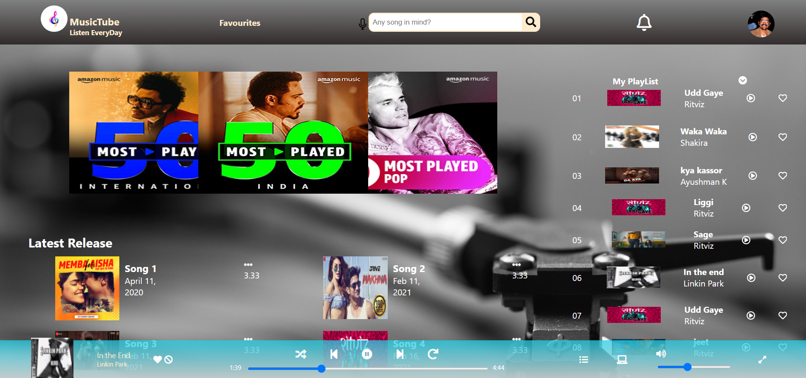
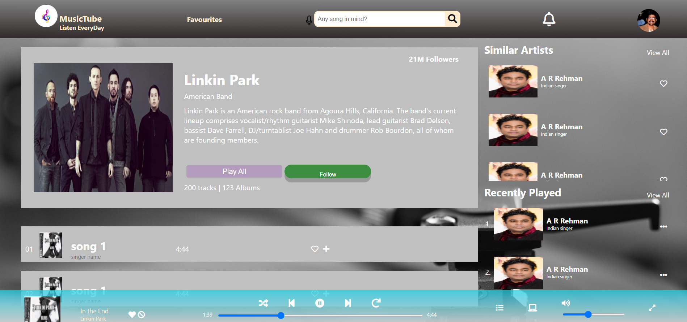

<h1 align="center">
  
  <h1 align="center">Music Tube . Com</h1>
</h1>

In this project, I have developed a static web application called Music.com with similar concepts of spotify, Amazon music, or any other music website.

Below are few ScreenShots of the Webapp:

 

## Tech/framework used

<b>Built with</b>
- HTML
- CSS
- [FontAwesome](https://fontawesome.com/)
- [BootStrap](https://getbootstrap.com/)

## Features
- Used HTML5 and CSS to develope this web site.
- Used bootStrap and Fontawesome for customization.

## You can reach out 😊😊

Feel free to contact me about the problems. I will try to help as much as I can 😉

## Acknowledgments

- Getting Better at HTML and CSS.
- Learning new stuffs
